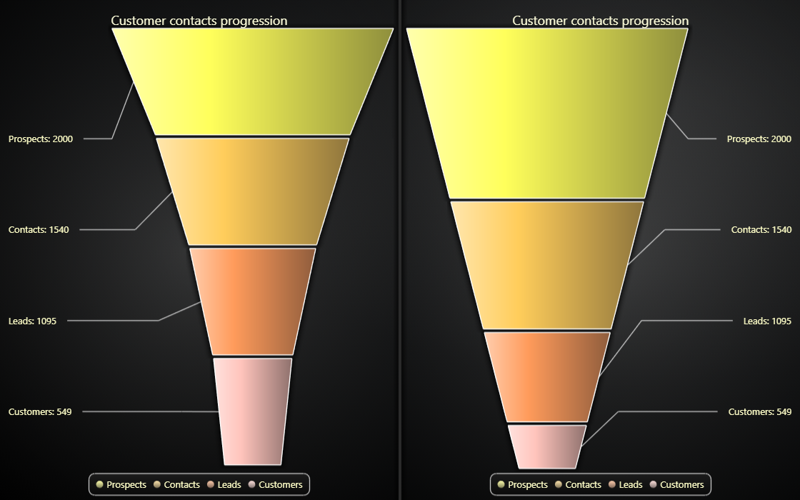

# JavaScript Funnel Chart



This demo application belongs to the set of examples for LightningChart JS, data visualization library for JavaScript.

LightningChart JS is entirely GPU accelerated and performance optimized charting library for presenting massive amounts of data. It offers an easy way of creating sophisticated and interactive charts and adding them to your website or web application.

The demo can be used as an example or a seed project. Local execution requires the following steps:

-   Make sure that relevant version of [Node.js](https://nodejs.org/en/download/) is installed
-   Open the project folder in a terminal:

          npm install              # fetches dependencies
          npm start                # builds an application and starts the development server

-   The application is available at _http://localhost:8080_ in your browser, webpack-dev-server provides hot reload functionality.


## Description

Funnel Chart is a chart used to show statistical graphic. Funnel Chart is divided into slices, with each slice illustrating the numerical portion of the Funnel. Each slice's size is proportional to its quantity.

The chart can be created with a simple line of code.

```javascript
// Create a new Funnel Chart.
const funnel = lightningChart().Funnel()
```

The Funnel has two types for displaying the labels for each slice; The slices can be placed either on top of each slice or the labels can be placed to the side of the Funnel, drawn with a connector line between the slice and its label.

If no type is given, the Funnel defaults to showing labels on side of Funnel.

```javascript
// Create a Funnel Chart with labels on the side.
const funnel = lightningChart().Funnel({ type: FunnelChartTypes.LabelsOnSide })

// Create a Funnel Chart with labels inside of slices.
const funnel = lightningChart().Funnel({
    type: FunnelChartTypes.LabelsInsideSlices,
})
```

After creating the Funnel Chart, we can populate it by adding slices to it.
The slice should always get a name and value as parameters.

You can alternatively add multiple slices as an array of objects containing a name and a value for each slice.

```javascript
// Add a single slice to the Funnel.
funnel.addSlice('Slice', 50)

// Add multiple slices to populate the Funnel.
const data = [
    {
        name: 'Prospects',
        value: 2000,
    },
    {
        name: 'Contacts',
        value: 1540,
    },
    {
        name: 'Leads',
        value: 1095,
    },
    {
        name: 'Customers',
        value: 549,
    },
]
// Add data to the slices
funnel.addSlices(data)
```

Modifying how the Funnel and its slices are drawn can be done through the Funnel Chart's API.

```javascript
// Set the gap between each of the slices. This value can be between 0 to 20 pixels.
funnel.setSliceGap(5)

// Set the width of the Funnel's top edge. This value can be from 0 to 100 (in percents).
funnel.setHeadWidth(95)

// Set the width of the Funnel's bottom edge. This value can be from 0 to 100 (in percents).
funnel.setNeckWidth(40)

// If the labels are set to be placed on the side of the Funnel,
// we can determine the side they will be placed.
funnel.setLabelSide(FunnelLabelSide.Right)
```

The slices can be styled using the Funnel Chart's API.

```javascript
// Create a palette of Fill Styles to use with the Funnel's Slices.
const palette = SolidFillPalette(ColorPalettes.warm, data.length)
// Set the palette used for coloring each of the slices.
funnel.setSliceFillStyle(palette)
```

The Funnel Chart has different ways to draw the slices depending on their value.

Perhaps the most common way is to show the value as the height of the slice in relation to the combined value of all slices.
This can be achieved by setting the Funnel's Slice Mode to Variable Height.

```javascript
// Set Funnel chart slice mode to Variable Height.
funnel.setSliceMode(FunnelSliceModes.VariableHeight)
```

Another common way is to show all the slices with equal height, but to have their width change depending on their value relative to the combined total value.

```javascript
// Set Funnel Chart slice mode to Variable Width.
funnel.setSliceMode(FunnelSliceModes.VariableWidth)
```

The labels for all slices can be formatted in different ways.

```javascript
// Set the label formatting to show the slice's name and value.
funnel.setLabelFormatter(SliceLabelFormatters.NamePlusValue)
```

The lines connecting each slice to its label can be modified.

```javascript
// Set the style that will be used with each connector line.
funnel.setLabelConnectorStyle(
    new SolidLine({
        thickness: 2,
        fillStyle: new SolidFill({ color: ColorRGBA(125, 95, 220) }),
    }),
)
```


## API Links

* [Funnel Chart]
* [Collection of Funnel Chart implementations]
* [Options for selecting side of labels]
* [Collection of modes for Funnel Slices]
* [s label implementations]
* [Collection of default color palletes]
* [Solid FillStyle]
* [Solid Line]


## Support

If you notice an error in the example code, please open an issue on [GitHub][0] repository of the entire example.

Official [API documentation][1] can be found on [LightningChart][2] website.

If the docs and other materials do not solve your problem as well as implementation help is needed, ask on [StackOverflow][3] (tagged lightningchart).

If you think you found a bug in the LightningChart JavaScript library, please contact sales@lightningchart.com.

Direct developer email support can be purchased through a [Support Plan][4] or by contacting sales@lightningchart.com.

[0]: https://github.com/Arction/
[1]: https://lightningchart.com/lightningchart-js-api-documentation/
[2]: https://lightningchart.com
[3]: https://stackoverflow.com/questions/tagged/lightningchart
[4]: https://lightningchart.com/support-services/

© LightningChart Ltd 2009-2022. All rights reserved.


[Funnel Chart]: https://lightningchart.com/js-charts/api-documentation/v7.0.1/classes/FunnelChart.html
[Collection of Funnel Chart implementations]: https://lightningchart.com/js-charts/api-documentation/v7.0.1/variables/FunnelChartTypes-1.html
[Options for selecting side of labels]: https://lightningchart.com/js-charts/api-documentation/v7.0.1/enums/FunnelLabelSide.html
[Collection of modes for Funnel Slices]: https://lightningchart.com/js-charts/api-documentation/v7.0.1/enums/FunnelSliceModes.html
[s label implementations]: https://lightningchart.com/js-charts/api-documentation/v7.0.1/variables/SliceLabelFormatters.html
[Collection of default color palletes]: https://lightningchart.com/js-charts/api-documentation/v7.0.1/variables/ColorPalettes.html
[Solid FillStyle]: https://lightningchart.com/js-charts/api-documentation/v7.0.1/classes/SolidFill.html
[Solid Line]: https://lightningchart.com/js-charts/api-documentation/v7.0.1/classes/SolidLine.html

